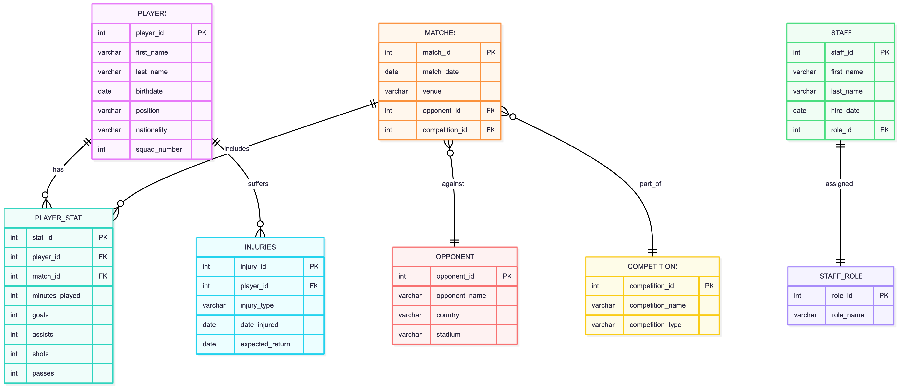

1.Database Summary Report

Liverpool Football Club.

Liverpool Football Club is one of the most successful and globally recognized football clubs, competing in the English Premier League. The club manages a large roster of professional players, coaches, medical staff, scouts, and administrative personnel. They operate out of Anfield as their home stadium and train at the AXA Training Centre. To maintain elite performance, Liverpool FC relies on detailed tracking of player performance, match statistics, training schedules, staff roles, and injuries.

Managing this information manually or across scattered documents creates inefficiencies. The club needs accurate, centralized information that coaches, analysts, and staff can use to make informed decisions. A relational database allows Liverpool FC to store mission-critical information in an organized, secure, and queryable way.

How Users Will Use the Database   

Coaches will use the database to view player details, check fitness status, track match performance, review goals and assists, and access training attendance. Analysts will use the database to run queries about match statistics, player availability, and performance trends. The medical team will manage injury histories and expected recovery dates. Administrative staff will add new players, schedule matches, and maintain staff records.

End users will interact with the database through SQL queries, views, and dashboards connected to applications or reporting tools. They will perform routine operations such as inserting match results, updating injuries, accessing performance reports, and reviewing roster changes. The database serves as a unified system supporting the entire professional football operations of Liverpool FC.

2.ER Model

Overall Design Description 

The Liverpool FC database is designed around core operational entities: players, matches, player statistics, injuries, and staff. The central table is PLAYERS, which connects to both PLAYER_STATS and INJURIES through foreign keys. This allows a single player to have multiple match records and injury records. The MATCHES table allows each match to be linked to multiple player stat entries, ensuring a full statistical record.

Normalization was applied to avoid redundancy: player information appears only in PLAYERS; match-level details are isolated in MATCHES; player performance details are in PLAYER_STATS; and injuries are stored in INJURIES. No denormalization was required, but PLAYER_STATS is intentionally wide because each row describes a full performance summary for one player in one match.

Table Purpose 

PLAYERS — Stores the roster of professional Liverpool FC players, their squad numbers, nationality, birthdate, and playing positions. This table is referenced by several other tables because players are the foundation of the system.

MATCHES — Stores information about each Liverpool game, including date, opponent, competition, and venue. It is used to link performance statistics to actual match events.

PLAYER_STATS — Stores all match-specific performance data such as goals, assists, minutes played, and passes. It links each player to each match they participated in.

INJURIES — Tracks player injuries, injury types, and expected recovery dates so coaches and staff can monitor availability.

STAFF — Stores non-player personnel such as coaches, physios, and analysts, with their roles and hire dates.
